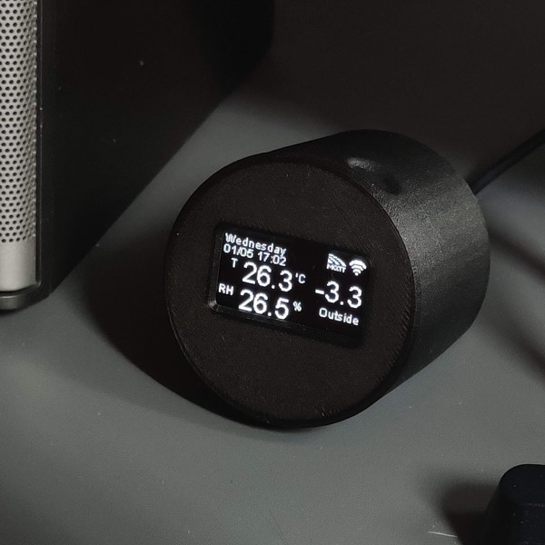

## What is it?
- A Clock that gets accurate time from the internet
- T & RH Display
- IoT Sensor sends the T & RH measurement to Blynk, and/or any MQTT broker of your choice




## Hardware
- ESP32 or ESP8266 microcontroller development board
- DHT22 Temperature & Relative Humidity Sensor
- 128x64 OLED Display with SH1106 controller and I2C Interface
- A mini breadboard


(Wemos D1 Mini as in the example)
- D1 - SCL of display
- D2 - SDA of display
- D4 - DHT signal
- 5V & GND ... obviously

## configuration
Create `arduino_secrets.h` as below
```
#define BLYNK_TEMPLATE_ID "....."
#define BLYNK_DEVICE_NAME "....."
#define BLYNK_AUTH_TOKEN "..............."

#define MQTT_BROKER "**.**.**.**"
#define MQTT_USER "..."
#define MQTT_PASS "..."
#define MQTT_TOPIC_PREFIX "dt/..../"
#define MQTT_TOPIC_SUFFIX "/..."

#define THIS_DEVICE_ID "ThisCoolESP"
```
